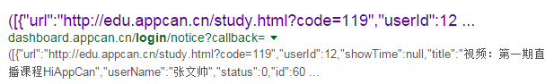
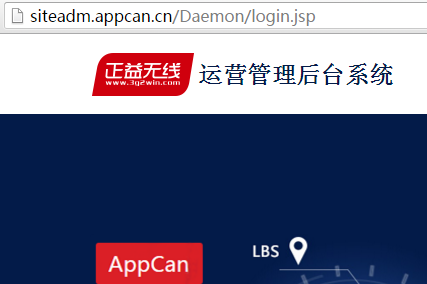
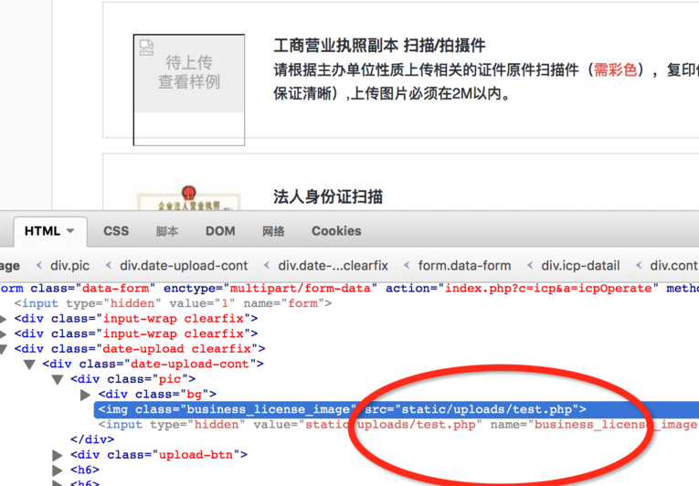
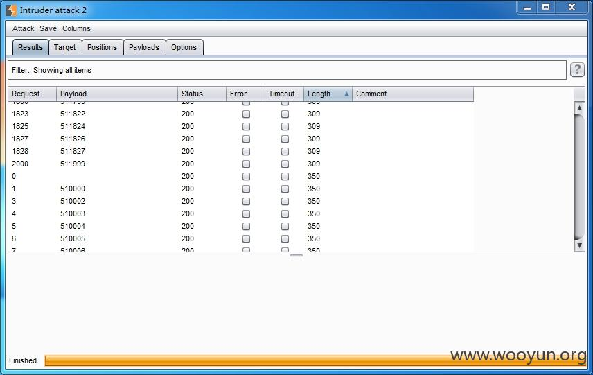

###1. 湖北师范学院  
链接：http://wooyun.org/bugs/wooyun-2010-0209311  
*  附件中上传jpg格式的木马 之后用burp改包  
*  Get到了工具中国菜刀哈哈哈哈哈：文件管理（有足够的权限时候可以管理整个磁盘/文件系统），数据库管理，虚拟终端
  1.  首先明确菜刀的使用前提：单独的菜刀没有效果，需要服务器端有一句话后门，或漏洞  
      例如这样的http://127.0.0.1:89/mingfang/index.php?q=${${@eval%28$_POST[cmd]%29}}
  2.  配置项如果你知道用户名密码就填，不知道，不填，也不会影响文件管理和虚拟终端这两个功能，只是不能查看数据库了。
  

###2.AppCan漏洞大礼包  
链接：http://wooyun.org/bugs/wooyun-2010-0198157  
*  在google中搜索site:appcan.cn inurl:login  
  在返回结果中发现一个json数据，里面发现一个名字"张文帅"  
  
*  在burp的请求历史中发现一个自动跳转的地址:http://siteadm.appcan.cn/Daemon/appshow/listinterfaceById?status=1&typeid=82&rows=8&callback=jQuery19103505221238365238_1461031756517&_=1461031756518  
直接访问http://siteadm.appcan/Daemon 跳转到后台登录地址  

*  想起之前发现的”张文帅”, 打算尝试一下,使用zhangwenshuai,zhangws,zhangwens,zws等用户名, 最后使用用户名zws弱口令123456爆破成功!!(嘻嘻，其实网站现已修改
*  上传图片一句话,还是解析失败,下载回来发现一句话被清除,应该是被二次渲染.找到未更改的地方再次添加一句话, 可惜还是失败..（联想WrriteUp_SCTF_pt200_homework针对这样的事件如何处理，是不是也是这个思路呢？
*  （这个才是最重要的）修复方案：  
1、xss过滤' " < > （ ）等字符  
2、SQL注入使用预编译的方式  
3、弱口令，更改密码  
4、文件上传，把上传文件放到不可执行路径中，设置好权限  
  
###3.某智能自助建站平台SQL注入/上传漏洞已拿到getshell  
链接：http://wooyun.org/bugs/wooyun-2010-0193742  
* 我上传了一个图片木马之后怎么找到它的存放路径呢？  
  
  
###4.中国南方航空公司某站存在任意文件上传漏洞  
链接：http://wooyun.org/bugs/wooyun-2010-0190447
* 直接上传php不行。  
 试了一下  
Test.php:a.jpg //重命名为jpg  
test.php. //可以但是重命名为jpg  
test.php::$DATA //成功  
  
###5.某省安全隐患排查治理信息系统敏感信息泄露/任意文件上传Getshell  
链接：http://wooyun.org/bugs/wooyun-2010-0194539  
* 利用Burp suite进行爆破  
  根据已有经验 登录口无验证码 可爆破 用burp设置用户名为510000-529999，密码123456进行批量测试。  
    
* 又遇到这个问题，怎样判断burp里的测试结果哪一个有用呢  
  Length值为309的为密码正确，Length值为350的表示密码错误  
  一般可根据返回字节长度判断呀  
* 找到上传文件点，进行一句话木马上传（可能需改包），菜刀连接  
  1. 使用其中一枚账号登录四川省安全隐患排查治理信息系统政府端，后台公共隐患台账模块存在任意文件上传漏洞，可getshell。
  2. 上传图片处burp抓包该包，上传aspx文件getshell。  
  3. 菜刀一句话马地址,连接密码ice  
  
###???不是很懂 MaticsoftSNS 1.9版本任意文件上传漏洞/中国人保寿险某分站任意文件上传导致getshell（影响路华救援多个分站/送sql注入）  
链接：http://wooyun.org/bugs/wooyun-2010-0137397/http://wooyun.org/bugs/wooyun-2010-0192794  
* 利用最简单的表单实现multipart/form-data方式上传脚本文件  
 如下的

```
<form action="http://localhost:8080/CMSUploadFile.aspx" enctype="multipart/form-data" method="post">

<input type="file" name="upload">

<input type="submit" value="upload">

</form>
```
